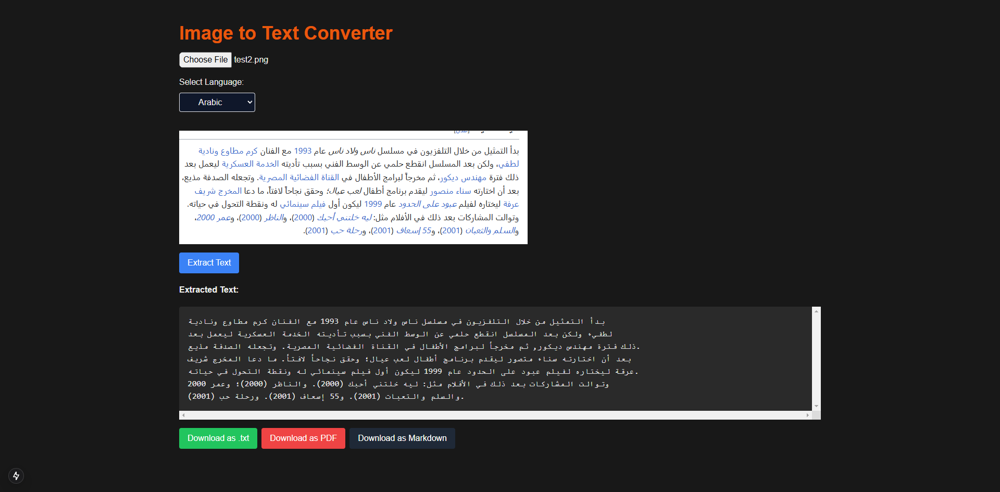
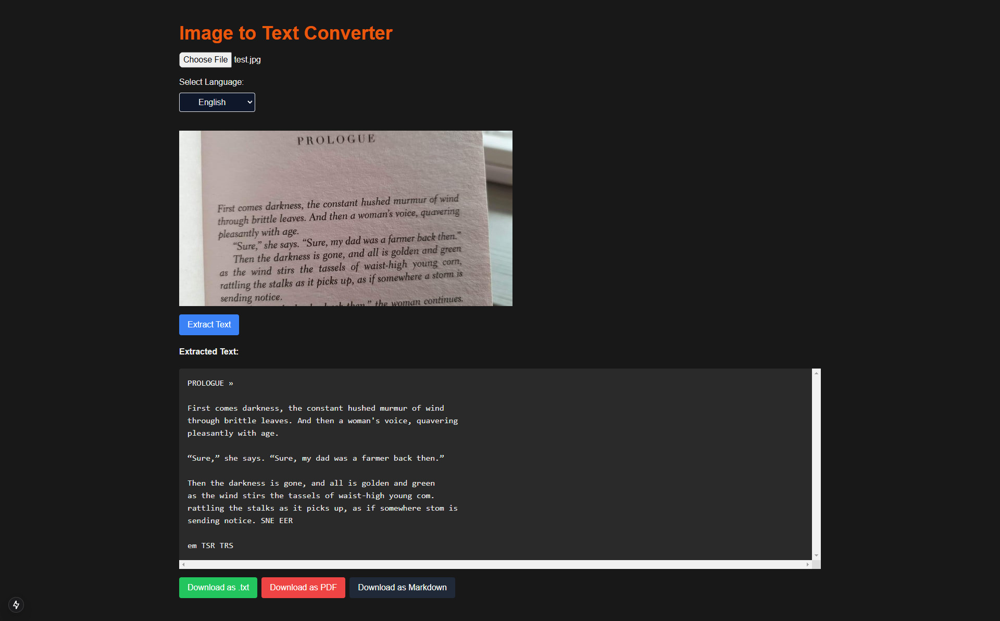

# 🖼️ Image to Text Converter

🚀 **A powerful web app that extracts text from images and allows exporting to multiple formats like `.txt`, `.pdf`, and `.md`.**  

This app is built with [Next.js](https://nextjs.org/) and uses [Tesseract.js](https://github.com/naptha/tesseract.js) for Optical Character Recognition (OCR).

---

## ✨ Features

- 🌍 **Multi-language Support**  
  Extract text in multiple languages like English, Arabic, Spanish, French, and more.

- 📤 **Export Options**  
  - Export text as `.txt`, `.pdf`, or `.md` files.

- 🖼️ **Image Upload**  
  Upload images via file selection or drag-and-drop.

- 🔄 **Image Preprocessing**  
  Enhance OCR accuracy with grayscale conversion and cropping (upcoming).

- 🕶️ **Dark Mode**  
  Seamless support for light and dark themes.

- 📱 **Responsive Design**  
  Optimized for mobile and desktop devices.

---

## 🛠️ Tech Stack

- **Frontend:** Next.js, Tailwind CSS
- **OCR Engine:** Tesseract.js
- **File Export:** jsPDF

---

## 🚀 Getting Started

### 1️⃣ Clone the Repository
```bash
git clone https://github.com/yourusername/image-to-text-converter.git
cd image-to-text-converter
```

### 2️⃣ Install Dependencies

```bash
npm install
```

### 3️⃣ Run the Development Server

```bash
npm run dev
```

*Visit http://localhost:3000 to view the app.*

---

## 📦 Export Formats

### 1. Plain Text (.txt)
- Extracted text saved as a plain text file.

### 2. PDF (.pdf)
- Export text as a PDF document.

### 3. Markdown (.md)
- Save text in Markdown format for documentation or blog use.

---

## 📸 Screenshots

### English:



### Arabic:



---

## 🤝 Contributing
Contributions are welcome! Here's how you can help:

- Fork the repository.
- Create a new branch for your feature or bug fix.
- Submit a pull request with a detailed description of your changes.

---

## 📄 License
This project is licensed under the MIT License.

## ⭐ Acknowledgements
- `Tesseract.js` - OCR engine
- `jsPDF` - PDF generation
- `Next.js` - React framework

## 🙌 Support

If you find this project useful, please consider giving it a ⭐ on GitHub and sharing it with others!
Have questions or feedback? Open an issue.

**Made with ❤️ by Mohamed Ibrahim**